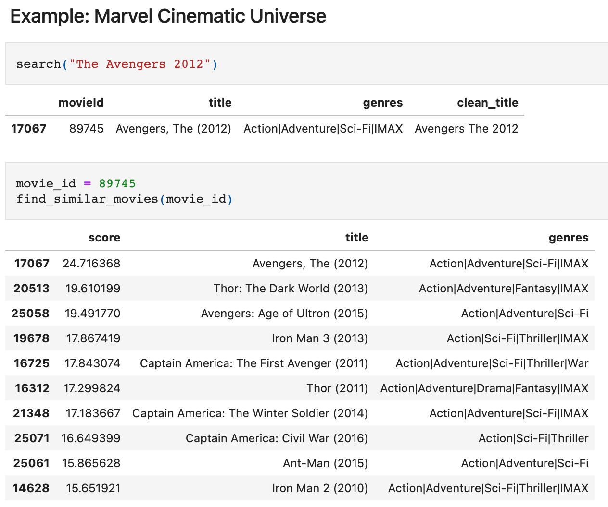
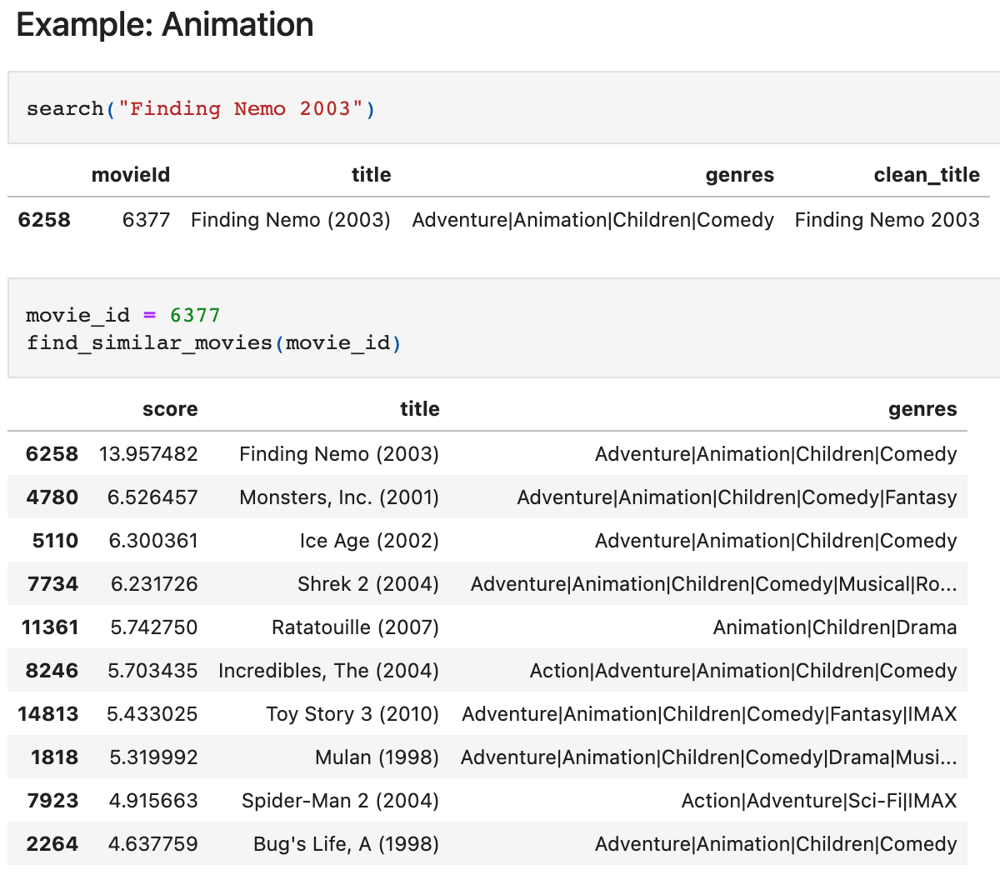

# A Simple Movie Recommendation Algorithm using TF-IDF in Python

The dataset can be accessed by this link: https://grouplens.org/datasets/movielens/25m/

## Problem Description

In this project, I create a movie recommendation system using TF-IDF (Term Frequency - Inverse Document Frequency). TF-IDF is a simple similarity-based algorithm for content-based recommendations with text datasets. It works in the CPU environment. 

The dataset is the MovieLens 25M dataset with 25 million ratings, 62,000 movies by 162,000 users.

## Recommendation Algorithm

I create a recommendation algorithm based on the interests of similar users vs. all users who liked at least one movie in the similar users recommendations list. The algorithm has three stages: (1) finding similar users, (2) finding users who liked a movie in the "similar users recommendations" list, and (3) calculating the final recommendation score.

### 1. Finding Similar Users

First, I find "similar users, i.e., users who gave 5 stars to the same movie that we search.

Then, I find all movies for which similar users gave 5 stars. This is called “similar users recommendations” list.

Next, for each movie in the similar users recommendations list, I find the percentage of similar users who gave 5 stars to that movie. Let’s call this “similar users percentage”. 

### 2. Finding Users Who Liked a Movie in the "Similar Users Recommendations" List

At this stage, I compare “similar users percentage” that was obtained in the previous stage with the percentage obtained from all users. To do that, I find all the users who gave five stars to at least one of the movies in the “similar movie recommendations” list. These are called “all users”.

Then, for each movie in the “similar user recommendations” list, I find the percentage of all users who gave 5 stars to that movie.  Let’s call this “all users percentage”. 

### 3. Calculating the Final Recommendation Score

Finally, I compute a recommendation score for each movie, which takes the ratio between similar users percentage and all users percentage. I rank the results and I recommend the movie with the highest recommendation score.

## Results

Searching for *The Avengers (2012)*, which is a Marvel movie, yields other Marvel movies.

Searching for *Finding Nemo (2003)*, which is an animation movie, results in other animation movies.

